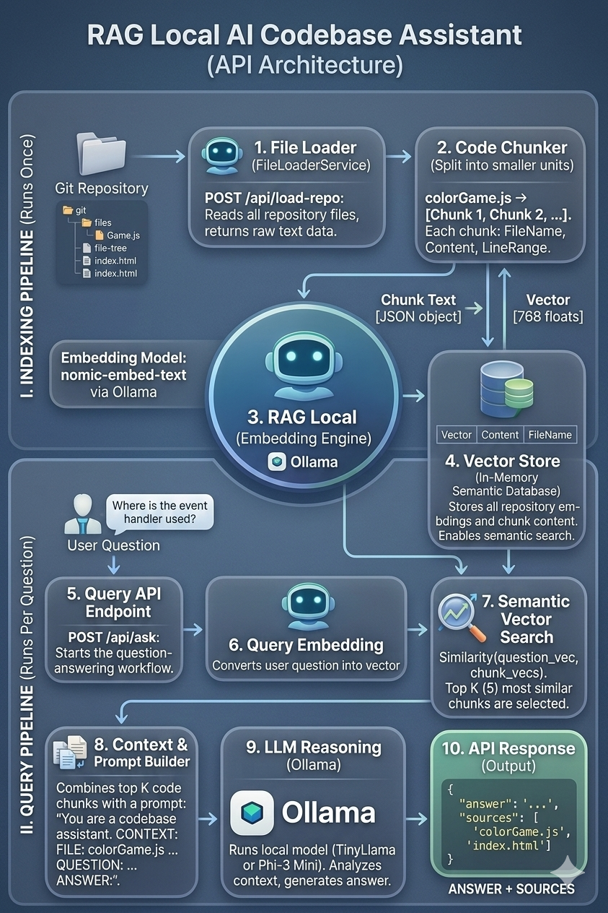
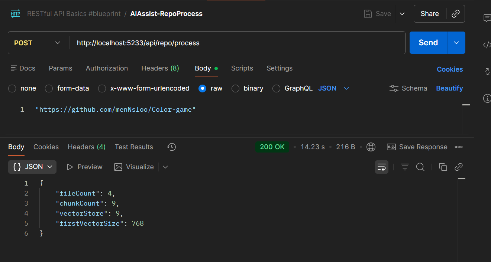
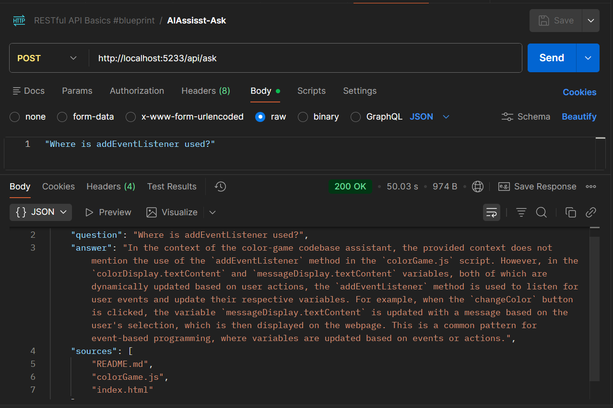

# Local RAG Code Assistant

## Architecture

The system follows a Retrieval Augmented Generation pipeline.

## Description

An AI-powered codebase question answering system that allows users to ask natural language questions about a repository.

Built using Retrieval Augmented Generation (RAG) with local LLM inference via Ollama.

Ask questions about a codebase like:

- Where is the event handler implemented?
- Which file contains the API call?
- Where is authentication handled?

The system retrieves relevant code chunks using semantic search and generates an answer using a local LLM.

## Tech Stack

Backend
- C# / .NET Web API
- REST API architecture

AI Components
- Ollama (local LLM runtime)
- nomic-embed-text (embedding model)
- TinyLlama / Phi-3 (LLM)

Core Concepts
- Retrieval Augmented Generation (RAG)
- Vector embeddings
- Cosine similarity search
- Semantic code search

## How It Works

1. Load repository files
2. Split files into code chunks
3. Generate embeddings for each chunk
4. Store embeddings in a vector store
5. Convert user question into embedding
6. Perform semantic similarity search
7. Retrieve top relevant code chunks
8. Send context to LLM
9. Generate final answer

## Run Locally

Install Ollama

https://ollama.com

Pull models

ollama pull nomic-embed-text
ollama pull tinyllama

Run the API

dotnet run

Load repository:
POST /api/load-repo

Ask questions:
POST /api/ask

## Example

